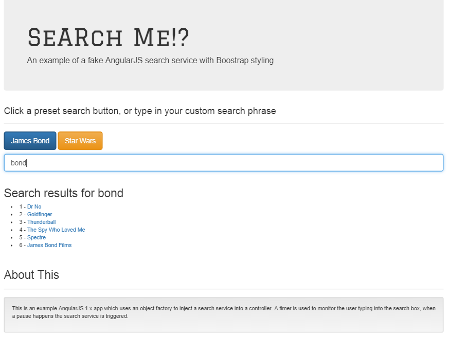

# SearchMe
A Bootstrap and AngularJS search application (demonstrating a fake search service)

##To Run
> Prequesites may include npm which is available when installing node from https://nodejs.org/en/

- Clone from Git.
- Install a lightweight test server (if you don't have one)

> npm install http-server -g

- Using a command prompt, navigate to the folder src\web of this project
- Type into the command prompt *http-server* to run up the server, this will be listening on port 8080 (by default)
- Now run up a browser and type in the URL *http://localhost:8080/index.html*
- This will bring up the Angular SearchMe app.

